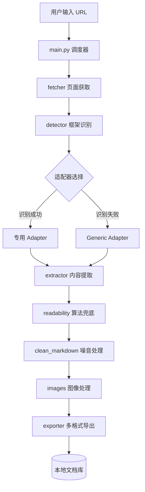

# Doc Crawler 🚀

**通用技术文档爬取工具** —— 将任意技术文档网站（Docusaurus, VuePress, MkDocs, GitBook 等）一键批量抓取并转换为结构清晰、内容纯净的本地 Markdown 知识库。

> **核心价值**：为大模型（LLM）训练、知识库构建（RAG）、NotebookLM 导入提供高质量的技术文档语料。

---

## 🏗️ 系统架构

Doc Crawler 采用模块化解耦设计，确保了对不同文档框架的灵活适配和极强的鲁棒性。



### 核心模块说明
- **Fetcher (智能获取)**：支持 `requests` 基础获取，具备 JS 渲染检测能力。
- **Detector (特征识别)**：通过 Meta 标签、CSS 类名、脚本指纹自动识别文档框架类型。
- **Framework Adapters (适配器层)**：预置 Docusaurus, VuePress, MkDocs, GitBook 规则。
- **Extractor (内容中枢)**：融合了适配器规则提取与 `readability` 结构化算法，确保在未知网站下也能提取正文。
- **Noise Cleaner (噪音清理)**：针对技术文档特有的图标字符（’）、侧边栏残留、代码复制按钮、底部导航进行深度清洗。
- **Images (图像托管)**：自动抓取图片并将其托管到本地目录，同步更新 Markdown 中的引用路径。

---

## 🛠️ 底层原理

### 1. 智能提取与兜底机制
程序首先尝试使用该框架特有的 CSS 选择器提取正文（以保持最高精确度）。如果不匹配，将自动调用 **Readability 算法**（类似浏览器的“阅读模式”）对 HTML 树进行加权评分，定位真实的文字内容区域。

### 2. 启发式导航检测
针对复杂的异步网站（如 SonarQube），程序会分析全站 `<a>` 标签，通过**路径深度优先**和**文本指纹过滤**技术，在没有 API 的情况下“猜”出整个侧边栏的目录树。

### 3. 内容深度清洗 (Clean Engine)
技术文档中常混有图标字体或特殊的 JS 片段，Doc Crawler 内置了一套强大的正则清洗引擎：
- **图标清理**：自动移除 `chevron-right`、`hashtag` 等图标占位。
- **编码修复**：修正 Windows-1252 常见的乱码（如 `’` -> `'`）。
- **结构化重组**：移除重复的 H1 标题，清理开头的多余面包屑导航。

---

## 🚀 快速开始

### 安装环境
```bash
# 克隆仓库后，安装依赖
pip install -r requirements.txt
```

### 启动爬取
```bash
# 运行主程序（交互式界面）
python main.py
```

### 操作流程
1. **输入起始 URL**：如 `https://docs.docker.com/get-started/`
2. **选择输出格式**：
   - `single`: 全部文档合并为一个 `all.md`（推荐用于导入 NotebookLM）。
   - `multiple`: 按原网站目录结构保存多个文件。
   - `json`: 用于程序化进一步处理。
3. **选择图片处理**：选择“是”将下载所有图片并自动处理路经。

---

## 📂 输出示例

```text
output/
└── docs.docker.com/
    ├── index.md           # 自动生成的目录索引
    ├── 01_Introduction.md # 自动清理后的正文
    ├── 02_Installation.md
    └── images/            # 本地化的图片资源
        └── img_abc_123.png
```

---

## 📖 深入了解
- [它是如何工作的？（通俗版原理说明）](docs/how_it_works.md)
- [需求规格](docs/requirements_v1.md)
- [实现方案](docs/implementation_plan.md)

## 📝 许可证
MIT License
