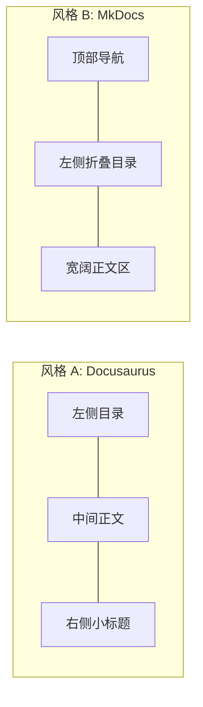
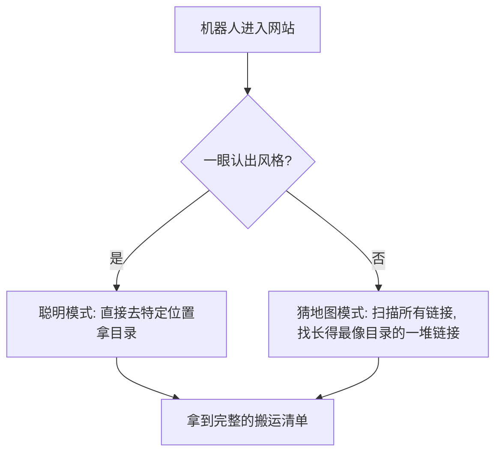
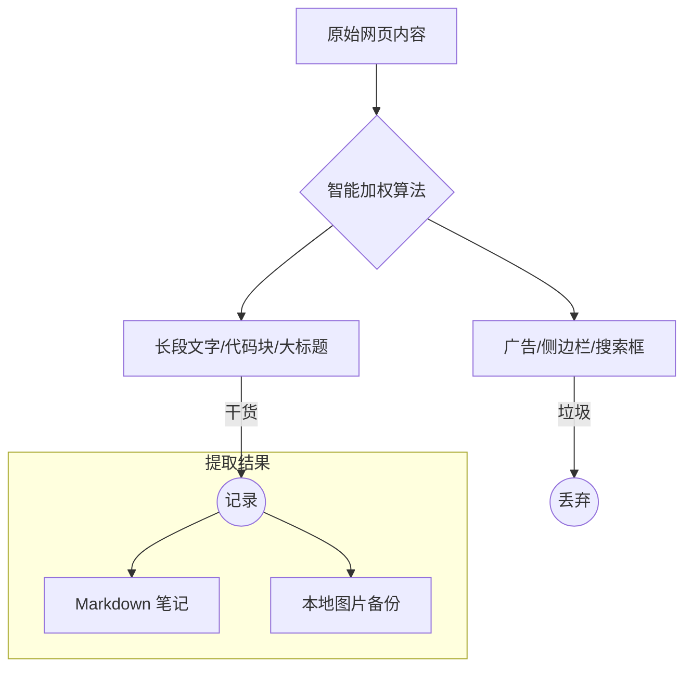

# 📖 Doc Crawler：它是如何工作的？（通俗版）

如果你不懂编程，没关系！你可以把 **Doc Crawler** 想象成一个专门去数字图书馆“抄书”的聪明机器人。

---

## 🏗️ 那些文档网站是怎么设计的？

想象一下，你走进一个非常大的图书馆，里面有很多不同的书格。虽然书的内容不同，但摆放方式通常只有几种固定的“装修风格”：

### 1. 装修风格与“模具工厂”
这些网站并不是美工一页页画出来的，而是像工厂生产一样，通过**“模具”+“原材料”**批量生成的：

-   **原材料 (Markdown)**：工程师写的纯文字笔记。
-   **模具 (模板)**：网站的装修风格（比如标题怎么放、目录长什么样）。
-   **生成过程**：电脑就像一个自动填表机器，把文字塞进模具里。

**为什么这很重要？** 
因为无论网页看起来多么花哨，我们只需要通过“逆向工程”，把塞进模具里的文字再“抠”出来。

### 2. 不同风格的图书馆布局
由于大家用的模具不多，所以摆放方式通常只有几种固定的风格：

### 2. 隐藏的地图（侧边栏/Navigation）
大多数文档网站都有一个“侧边栏”，就像是书的**详细目录**。它告诉机器人：哪一页在哪，它们之间是什么父子关系。

---

## 🤖 我们的机器人搬运流程

Doc Crawler 搬书的过程可以简单分为三步：

### 第一步：找地图（导航提取）
机器人进站后，第一件事是寻找侧边栏。

### 第二步：智能阅读（内容提取）
找到具体的某一页后，机器人需要把“正文”抄下来，但它得避开周围的干扰信息。

### 第三步：深度大扫除（清理引擎）
这是最关键的一步。抄下来的草稿里经常会有垃圾，机器人会拿着“橡皮擦”和“胶水”进行处理。

---

## 🎯 最终你得到的是什么？

最后，机器人会根据你的需求，把笔记整理成你喜欢的样子：

| 交付形式 | 形象描述 | 最佳用途 |
| :--- | :--- | :--- |
| **合订本 (all.md)** | 把几百页的文档装订成一本厚厚的大书 | 喂给 AI (如 NotebookLM) 学习全站知识 |
| **文件夹版** | 像书架一样，按原来的文件夹存好 | 放在本地编辑器里慢慢看，或者离线查阅 |

---

**总结**：Doc Crawler 就是一个能自动识别网站“长相”，绕过干扰项，把干货内容完整、干净地搬回家的自动化小秘书。
