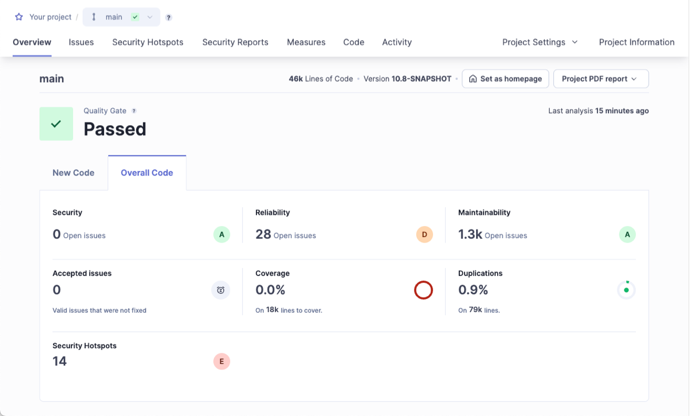

# Try out SonarQube Server

sparkleAskchevron-down

# Try out SonarQube Server

Follow these steps to try out SonarQube Server.

You’ve heard about how [SonarQube Serverarrow-up-right](https://www.sonarsource.com/products/sonarqube/) can help you write high quality, safer code, and now you’re ready to try it out for yourself. This guide shows you how to install a local instance of SonarQube Server and analyze a project. Installing a local instance gets you up and running quickly, so you can experience SonarQube Server firsthand.

You can try [Developer editionarrow-up-right](https://www.sonarsource.com/plans-and-pricing/developer/) or [Enterprise editionarrow-up-right](https://www.sonarsource.com/plans-and-pricing/enterprise/) for free for 14 days.

Once you’re ready to set up a production instance, take a look at the [Introduction](/sonarqube-server/server-installation/introduction) documentation on installing the Developer or Enterprise Editions.

### 

[hashtag](#installing-a-local-instance-of-sonarqube)

Installing a local instance of SonarQube Server

You can evaluate SonarQube Server using a traditional installation with the [zip filearrow-up-right](https://www.sonarsource.com/products/sonarqube/downloads/) or you can spin up a Docker container using one of our [Docker imagesarrow-up-right](https://hub.docker.com/_/sonarqube/). Select the method you prefer below to expand the installation instructions:

chevron-rightFrom the zip file[hashtag](#from-the-zip-file)

  1. Download and install [Java 21arrow-up-right](https://adoptium.net/en-GB/temurin/releases/?version=21) on your system.

  2. [Downloadarrow-up-right](https://www.sonarsource.com/products/sonarqube/downloads/) the SonarQube Developer Edition zip file.

  3. As a **non-**`**root**` **user** , unzip it in, for example, `C:\sonarqube` or `/opt/sonarqube`.

  4. As a **non-**`**root**` **user** , start the SonarQube server:

Copy
    
    
    # On Windows, execute:
    C:\sonarqube\bin\windows-x86-64\StartSonar.bat
     
    # On other operating systems, as a non-root user execute:
    /opt/sonarqube/bin/<OS>/sonar.sh console

If your instance fails to start, check your [Server logs](/sonarqube-server/server-update-and-maintenance/troubleshooting/server-logs) to find the cause.

chevron-rightFrom the Docker image[hashtag](#from-the-docker-image)

Find the Developer Edition Docker image on [Docker hubarrow-up-right](https://hub.docker.com/_/sonarqube/).

  1. Start the server by running:

Copy
    
    
    $ docker run -d --name sonarqube -e SONAR_ES_BOOTSTRAP_CHECKS_DISABLE=true -p 9000:9000 sonarqube:latest

Once your instance is up and running, Log in to http://localhost:9000 using System Administrator credentials:

  * login: admin

  * password: admin

### 

[hashtag](#analyzing-a-project)

Analyzing a project

Now that you’re logged in to your local SonarQube Server instance, let’s analyze a project:

  1. Select **Create new project**.

  2. Give your project a **Project key** and a **Display name** and select **Set up**.

  3. Under **Provide a token** , select **Generate a token**. Give your token a name, select **Generate** , and click **Continue**.

  4. Select your project’s main language under **Run analysis on your project** , and follow the instructions to analyze your project. Here you’ll download and execute a scanner on your code (if you’re using Maven or Gradle, the scanner is automatically downloaded).

After successfully analyzing your code, you’ll see your first analysis on SonarQube Server:

Your first analysis is a measure of your current code. As a developer, you focus on maintaining high standards and taking responsibility specifically for the new code you’re working on. Code that has been added or changed from this point should be your focus moving forward. See [Quality standards and new code](/sonarqube-server/user-guide/about-new-code) for more information.

[PreviousHomepagechevron-left](/sonarqube-server)[NextAI capabilitieschevron-right](/sonarqube-server/ai-capabilities)

Was this helpful?