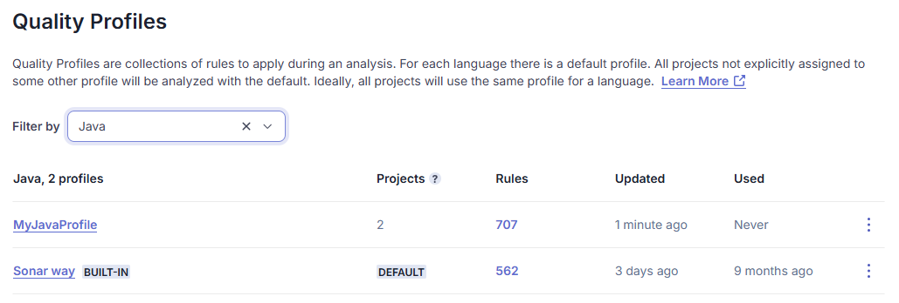
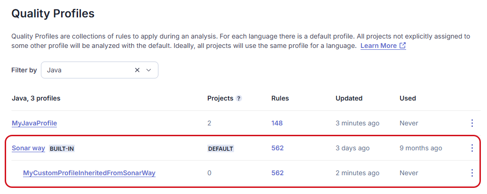

# Understanding quality profiles

sparkleAskchevron-down

  1. [Quality standards administration](/sonarqube-server/quality-standards-administration)chevron-right
  2. [Managing quality profiles](/sonarqube-server/quality-standards-administration/managing-quality-profiles)

# Understanding quality profiles

Quality profiles are a key part of your SonarQube Server configuration because they are composed of a list of rules to check your code against.

### 

[hashtag](#quality-profile-set-assigned-to-a-language)

Quality profile set assigned to a language

Several quality profiles can be assigned to a language:

  * A built-in profile is provided at installation and is called the Sonar way profile. You cannot edit this profile.

  * You can create custom quality profiles to meet your coding analysis needs. The Sonar way profile is designed to be broadly suitable for most projects, but it is intended only as a starting point.

In the quality profile set of a language, a profile is defined as the default profile. The default profile is used for the analysis of a project if no profile is explicitly defined for that project.

The figure below shows a quality profile set example of the Java language. In this example, the built-in profile is the default profile and one custom profile has been added.

A user with the Administer Quality Profiles permission can create and edit any custom profile and change the default profile of a set. These users can also give other users permission to edit a given custom profile.

### 

[hashtag](#quality-profile-definition)

Quality profile definition

A quality profile:

  * Relates to a given programming language.

  * Is based on the set of coding rules supported for this language.

  * Defines which rules of this set are active in the profile, it means which rules will be taken into account during the code analysis.

A custom quality profile may customize, for a given rule, the following parameters:

  * Severity level(s).

  * When applicable: configurable rule parameters. For example, rules that verify conditions against a threshold might allow customization of the threshold value.

The customization applies only within the quality profile. In particular, it will not change the rule’s recommended severity levels on the **Rules** platform.

In addition, from the [Enterprise Editionarrow-up-right](https://www.sonarsource.com/plans-and-pricing/enterprise/), rules can be mark as Prioritized in a quality profile. Prioritized rules are used to fail the quality gate when the corresponding prioritized issues are raised in the overall code.

### 

[hashtag](#quality-profile-inheritance)

Quality profile inheritance

The inheritance feature allows you to define a parent/child relationship between two quality profiles within the profile set of a language. This way, changes in the parent profile are dynamically reported to the child profile. Note that a child profile can only be a custom quality profile.

The figure below shows the Java’s profile set example with a custom profile inheriting from the built-in Sonar way profile.

By inhering from the built-in quality profile Sonar way, you ensure that you automatically benefit from:

  * Newly implemented rules.

  * Changes in a rule’s configuration.

  * The deactivation of deprecated rules.

You can also create a quality profile hierarchy: a change in a parent profile is reflected in all its child profiles on all hierarchy levels.

The following principles govern the quality profile inheritance:

  * The inheritance relationship can be established or removed according to the following:

    * A parent profile can be assigned to a child profile during the child profile creation or at any time during the lifecycle of a custom profile.

    * The inheritance relationship can be removed at any time.

    * A child profile can change to another parent at any time.

    * A parent profile may be a built-in or a custom profile (A child profile is always a custom profile.).

  * When an inheritance relationship is established:

    * The child quality profile inherits its parent’s active rules.

    * Active rules existing already in the child profile are not changed.

  * A change in a parent profile is automatically reflected in all its child profiles (note that if a child profile changes to another parent, this is considered a change in the parent profile). It means that:

    * A rule activation or deactivation in the parent profile is reflected in the child profiles whatever the status (active or inactive) of the rule in the child profile.

    * A rule parameter change in the parent profile is reflected in the child profiles if the rule is not overridden in the child profile.

  * A child quality profile can be changed as follows:

    * An inactive rule can be activated.

  * If enabled at the global level, an active rule can be deactivated.

  * A rule’s severity level(s) or configurable parameters can be modified compared to the parent profile. In that case, the rule is considered _overridden_.

circle-info

The principles described above are the same whether the parent profile is a built-in or a custom profile.

circle-info

If Sonar updates the rules set of a language (for instance, by adding or changing a rule) and/or the respective built-in quality profile, this update will be available in your SonarQube once you have upgraded it.

### 

[hashtag](#quality-profile-association-with-projects)

Quality profile association with projects

The default quality profile of a language’s profile set is used for a project if the project is not explicitly associated with another profile for this language.

By default, the built-in profile is the default profile for every language. With the Administer Quality Profiles permission, you can change the default profile of a given language.

As a project administrator, you can assign quality profiles to your project. With the Administer Quality Profiles permission, you can assign a quality profile to a list of projects.

### 

[hashtag](#related-pages)

Related pages

  * [Viewing quality profiles](/sonarqube-server/quality-standards-administration/managing-quality-profiles/viewing-quality-profiles)

  * [Creating a quality profile](/sonarqube-server/quality-standards-administration/managing-quality-profiles/creating-a-quality-profile)

  * [Editing a quality profile](/sonarqube-server/quality-standards-administration/managing-quality-profiles/editing-a-custom-quality-profile)

  * [Associating with projects](/sonarqube-server/quality-standards-administration/managing-quality-profiles/associating-a-quality-profile-with-projects)

  * [Changing default quality profile](/sonarqube-server/quality-standards-administration/managing-quality-profiles/changing-default-quality-profile)

  * [Maintaining quality profiles](/sonarqube-server/quality-standards-administration/managing-quality-profiles/maintaining-your-custom-quality-profiles)

  * [Granting permissions to users](/sonarqube-server/quality-standards-administration/managing-quality-profiles/authorizing-other-users-to-manage-quality-profile)

  * [Changing your project's quality profiles](/sonarqube-server/project-administration/adjusting-analysis/changing-quality-gate)

[PreviousIntroductionchevron-left](/sonarqube-server/quality-standards-administration/managing-quality-profiles/introduction)[NextViewing quality profileschevron-right](/sonarqube-server/quality-standards-administration/managing-quality-profiles/viewing-quality-profiles)

Was this helpful?