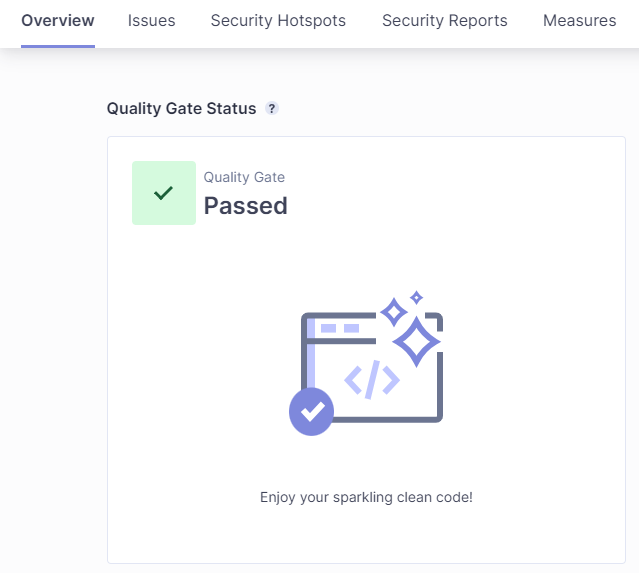
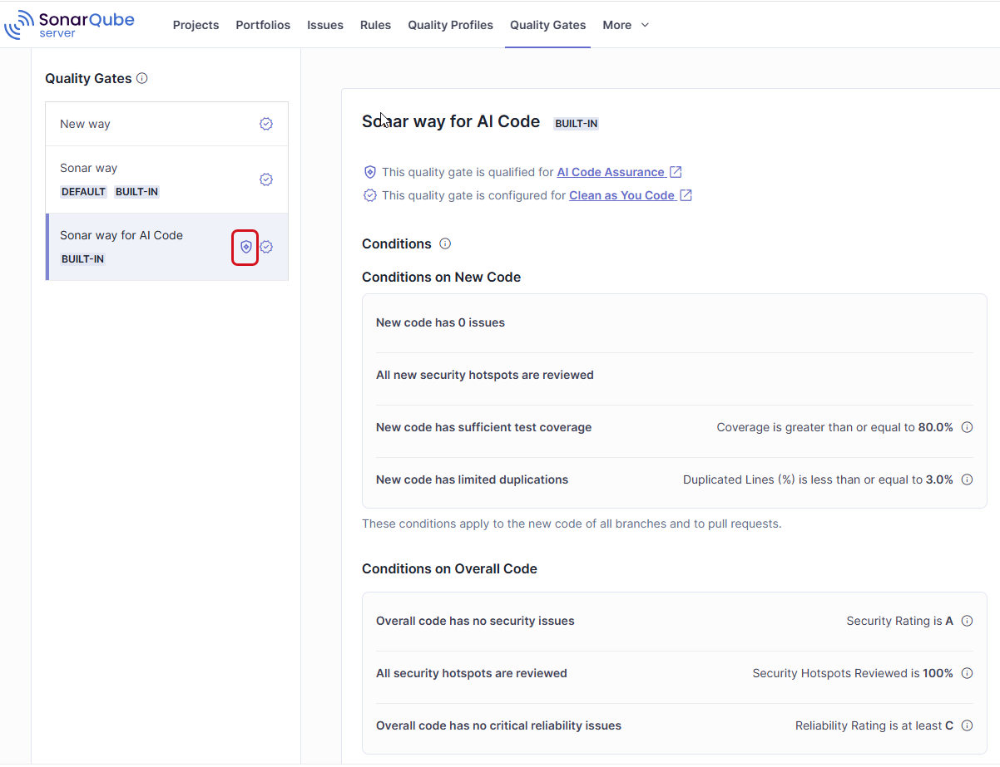

# Understanding quality gates

sparkleAskchevron-down

  1. [Quality standards administration](/sonarqube-server/quality-standards-administration)chevron-right
  2. [Managing quality gates](/sonarqube-server/quality-standards-administration/managing-quality-gates)

# Understanding quality gates

SonarQube Server quality gates use sets of conditions to measure checks against your code during analysis. Depending on result, code passes or fails the quality gate.

Quality gates enforce a quality policy for the results of code review and analysis in your organization by answering one question: is my project ready for release?

A quality gate consists of a set of conditions against which the code is measured during analysis. A condition is defined on either new code or overall code. Depending on the result, the code will pass or fail the quality gate, giving developers indications on whether to fix issues or merge the code.

The quality gate status appears with analysis results of the main branch, other branches, and pull requests in the project’s **Overview** page as illustrated below.

circle-info

  * Any user can subscribe to email notifications on quality gate change for a project or all projects.

  * For pull requests, the quality gate status will also be displayed in the repository platform as a pull request decoration. It can be used to block the merge of the pull request if the quality gate fails.

  * The quality gate status can be reported to your CI pipeline. It can be used to fail your CI pipeline if the quality gate fails.

### 

[hashtag](#basic-principles)

Basic principles

Each project is assigned a quality gate. A default quality gate is defined in your instance and applied to all projects not explicitly assigned to a quality gate.

You may have to use several quality gates depending on your projects:

  * The technological implementation differs from one application to another. For example, you might not require the same code coverage on new code for web applications as you would for Java applications.

  * You want to ensure stronger requirements on some of your applications, for example, internal frameworks.

  * You should use a quality gate qualified for AI Code Assurance if your project contains AI code.

Two built-in quality gates are provided: **Sonar way** which is used by default as the default quality gate, and **Sonar way for AI Code** which is recommended for projects containing AI code. You can create your own quality gates, called custom quality gates.

To create and update custom quality gates, the Administer Quality Gates permission is required. With this permission, you can also associate projects with quality gates and allow another user to administer a given custom quality gate. As a project manager, you can associate your project with a quality gate.

circle-info

Quality gates can be managed in the UI or through the [Web APIarrow-up-right](https://next.sonarqube.com/sonarqube/web_api/api/qualitygates?query=quality+gates).

### 

[hashtag](#definition-based-on-conditions)

Quality gate definition based on conditions

A quality gate is defined through a set of conditions on metrics calculated during the analysis. Starting in [Enterprise editionarrow-up-right](https://www.sonarsource.com/plans-and-pricing/enterprise/), you can also use a condition on prioritzed rules.

#### 

[hashtag](#conditions-on-metrics)

Conditions on metrics

Each condition applies to a given metric applying either to new code or overall code. If one of the conditions is met, the quality gate fails. More information can be found on the [Quality standards and new code](/sonarqube-server/user-guide/about-new-code) page

circle-info

In case of a pull request analysis, only the quality gate conditions applying to new code are used.

Metrics you can use include:

  * Statistics and ratings on detected security, maintainability, and reliability issues.

  * Statistics on test coverage.

  * Code cyclomatic and cognitive complexities.

  * Statistics and ratings on reviewed security hotspots.

  * Statistics on duplicated lines and blocks.

  * Statistics on code size (the number of various code elements).

  * Global statistics on issues.

Each quality gate condition is a combination of:

  * A metric

  * A comparison operator

  * An error value

For instance, a condition might be

  * Metric: Blocker issue

  * Comparison operator: >

  * Error value: 0

Which can be stated as: No blocker issues.

For more information on the metrics, see [Understanding measures and metrics](/sonarqube-server/user-guide/code-metrics/metrics-definition).

circle-info

While test code quality impacts your quality gate, it’s only measured based on the Maintainability and Reliability metrics in MQR Mode and Code Smells and Bugs metrics in Standard Experience. Duplication and security issues are not measured on test code.

#### 

[hashtag](#condition-on-prioritized-rules)

Condition on prioritized rules

Starting in [Enterprise editionarrow-up-right](https://www.sonarsource.com/plans-and-pricing/enterprise/), rules can be marked as prioritzed in a custom quality profile. A quality gate can be set to fail if prioritized issues are detected in the overall code.

### 

[hashtag](#sonar-way-recommended-quality-gate)

Sonar way, the recommended quality gate

The **Sonar way** quality gate is Sonar’s recommended quality gate for your new code, helping you achieve high quality code. It is provided by Sonar, activated by default, and read-only. More information can be found on the [Quality standards and new code](/sonarqube-server/user-guide/about-new-code) page.

This quality gate focuses on keeping high quality standards for new code, rather than spending a lot of effort remediating old code.

The Sonar way quality gate has four conditions:

  * No new issues are introduced

  * All new Security Hotspots are reviewed

  * New code test coverage is greater than or equal to 80.0%

  * Duplication in the new code is less than or equal to 3.0%

### 

[hashtag](#sonar-way-for-ai-code)

Sonar way for AI Code

The built-in quality gate **Sonar way for AI Code** is recommended for projects that contain AI code. You can also create your custom quality gates and qualify them for AI Code Assurance. The user guide about setting up AI Code Assurance for your project begins with the page, [Set your AI standards](/sonarqube-server/quality-standards-administration/ai-code-assurance/overview).

**Sonar way for AI Code** is shown below. A specific icon is used to indicate that the quality gate is qualified for AI Code Assurance.

### 

[hashtag](#quality-gate-computation)

Quality gate computation

Within a specific project, the same quality gate definition is always used for all quality gate status computations. However, the way that the calculations are done differs somewhat between the branches and pull requests. In addition, a fudge factor is used by default during quality gate calculation.

#### 

[hashtag](#computation-for-branches)

Computation for branches

  * Both the conditions defined on _overall code_ and conditions defined on _new code_ are applied.

  * What counts as _new code_ is determined by the prevailing new code definition setting for the branch, as described on the page, [Quality standards and new code](/sonarqube-server/user-guide/about-new-code).

#### 

[hashtag](#computation-for-pull-requests)

Computation for pull requests

  * Only conditions defined on _new code_ are applied.

  * And, _new code_ is defined as whatever has changed relative to the target branch, as described on the [Pull request analysis](/sonarqube-cloud/improving/pull-request-analysis) page.

#### 

[hashtag](#quality-gate-fudge-factor)

Quality gate fudge factor

The quality gate fudge factor refers to a mechanism where:

  * The conditions on duplication are ignored until the _number of new lines_ is at least 20.

  * The conditions on coverage are ignored until the _number of new lines to cover_ is at least 20.

This is used to avoid overly strict enforcement when dealing with small changes, as minor issues might disproportionately impact the overall quality gate status.

The fudge factor is enabled by default in your instance. This global setting is applied to all new projects. Project administrators can override it for their project.

### 

[hashtag](#quality-gate-and-new-code)

Quality gate and new code

To ensure that developers are not introducing issues in their code, all built-in quality gates are configured to prevent introducing issues in new code.

**No new issues are introduced**

This is implemented through the following failing condition(s) _on new code_ :

  * Either:

    * The Number of issues is higher than 0.

  * Or:

    * Reliability Rating is worse than A.

    * Security Rating is worse than A.

    * Maintainability Rating is worse than A.

Note that while the three rating conditions help improve the quality of new code, they still allow some technical debt to sneak into your codebase. Instead, using the 0 issues condition will ensure that your new code is completely free from any issues.

**All new security hotspots have been reviewed**

This is implemented through the following failing condition _on new code_ :

  * Security Hotspots Reviewed is less than 100%.

**New code has sufficient test coverage**

This is implemented through the following failing condition _on new code_ :

  * Coverage is less than X%, where X is configurable.

**New code has limited duplications**

This is implemented through the following failing condition _on new code_ :

  * The duplicated lines density is greater than X%, where X is configurable.

For information on the metrics, see the [Understanding measures and metrics](/sonarqube-server/user-guide/code-metrics/metrics-definition) page.

### 

[hashtag](#related-pages)

Related pages

  * [Viewing a quality gate](/sonarqube-server/quality-standards-administration/managing-quality-gates/viewing-quality-gate)

  * [Managing custom quality gates](/sonarqube-server/quality-standards-administration/managing-quality-gates/managing-custom-quality-gates)

  * [Changing instance's default quality gate](/sonarqube-server/quality-standards-administration/managing-quality-gates/changing-default-quality-gate)

  * [Managing custom quality gates](/sonarqube-server/quality-standards-administration/managing-quality-gates/managing-custom-quality-gates)

  * [Associating a quality gate with projects](/sonarqube-server/quality-standards-administration/managing-quality-gates/associating-projects-with-quality-gate)

  * [Notifications](/sonarqube-server/user-guide/managing-your-account/subscribing-to-notifications)

  * [Managing your project's quality gate](/sonarqube-server/project-administration/adjusting-analysis/changing-quality-gate-and-fudge-factor)

  * Changing the quality gate fudge factor:

    * [Quality standards](/sonarqube-server/instance-administration/analysis-functions/quality-standards)

    * [Managing your project's quality gate](/sonarqube-server/project-administration/adjusting-analysis/changing-quality-gate-and-fudge-factor)

**DevOps platform integration features:**

  * Preventing the merge of pull requests on quality gate failure for your project:

    * [Setting up GitHub integration for your project](/sonarqube-server/devops-platform-integration/github-integration/setting-up-at-project-level)

    * [Bitbucket Data Center](/sonarqube-server/devops-platform-integration/bitbucket-integration/bitbucket-server-integration)

    * [Bitbucket Cloud integration](/sonarqube-server/devops-platform-integration/bitbucket-integration/bitbucket-cloud-integration)

    * [Setting up GitLab integration for your project](/sonarqube-server/devops-platform-integration/gitlab-integration/setting-up-at-project-level)

    * [Setting up Azure integration for your project](/sonarqube-server/devops-platform-integration/azure-devops-integration/setting-up-project-integration)

  * Failing your CI pipeline on quality gate failure:

    * [Setting up a pipeline pause](/sonarqube-server/analyzing-source-code/ci-integration/jenkins-integration/pipeline-pause)

    * [Adding analysis to GitHub Actions workflow](/sonarqube-server/devops-platform-integration/github-integration/adding-analysis-to-github-actions-workflow)

    * [Bitbucket Cloud integration](/sonarqube-server/devops-platform-integration/bitbucket-integration/bitbucket-cloud-integration)

    * [Adding analysis to GitLab CI/CD pipeline](/sonarqube-server/devops-platform-integration/gitlab-integration/adding-analysis-to-gitlab-ci-cd)

[PreviousIntroductionchevron-left](/sonarqube-server/quality-standards-administration/managing-quality-gates/introduction)[NextViewing a quality gatechevron-right](/sonarqube-server/quality-standards-administration/managing-quality-gates/viewing-quality-gate)

Last updated 16 days ago

Was this helpful?